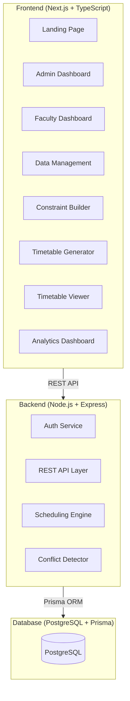

# 🎓 College Timetable Generation System — Implementation Plan

## Overview
A full-stack web application for automatic college timetable generation with constraint satisfaction, conflict detection, and optimization.

## Architecture

## Tech Stack
| Layer | Technology |
|-------|-----------|
| Frontend | Next.js 14, TypeScript, Tailwind CSS, ShadCN UI |
| Backend | Node.js, Express, TypeScript |
| Database | PostgreSQL, Prisma ORM |
| Auth | JWT (jsonwebtoken, bcrypt) |
| Algorithm | CSP + Backtracking + Genetic Algorithm |
| Charts | Recharts |
| Export | jsPDF, xlsx, csv |

## Phase Plan

### Phase 1: Project Setup & Database Schema
- Initialize Next.js frontend
- Initialize Express backend
- Define Prisma schema with all tables
- Set up JWT auth

### Phase 2: Backend API
- CRUD for all academic entities
- Constraint management API
- Auth endpoints
- Schedule generation endpoint

### Phase 3: Scheduling Algorithm
- CSP solver with backtracking
- Genetic algorithm optimizer
- Conflict scoring system
- Constraint validator

### Phase 4: Frontend Pages
- Landing page
- Admin dashboard
- Data management forms
- Constraint builder UI
- Timetable viewer with drag-and-drop
- Analytics dashboard

### Phase 5: Export & Deployment
- PDF/Excel/CSV export
- Docker configuration
- Deployment guides

## Database Tables
1. `departments` - Academic departments
2. `semesters` - Academic semesters
3. `teachers` - Faculty members
4. `subjects` - Course subjects
5. `rooms` - Classrooms and labs
6. `batches` - Student batches
7. `time_slots` - Available time slots
8. `constraints` - Scheduling constraints
9. `schedules` - Generated schedules
10. `schedule_entries` - Individual schedule entries
11. `users` - Authentication users

## API Endpoints
| Method | Endpoint | Description |
|--------|----------|-------------|
| POST | /api/auth/register | Register user |
| POST | /api/auth/login | Login |
| CRUD | /api/departments | Manage departments |
| CRUD | /api/semesters | Manage semesters |
| CRUD | /api/teachers | Manage teachers |
| CRUD | /api/subjects | Manage subjects |
| CRUD | /api/rooms | Manage rooms |
| CRUD | /api/batches | Manage batches |
| CRUD | /api/time-slots | Manage time slots |
| CRUD | /api/constraints | Manage constraints |
| POST | /api/generate | Generate timetable |
| GET | /api/timetable/:id | Get timetable |
| PUT | /api/timetable/edit-slot | Edit slot |
| GET | /api/analytics | Get analytics |
